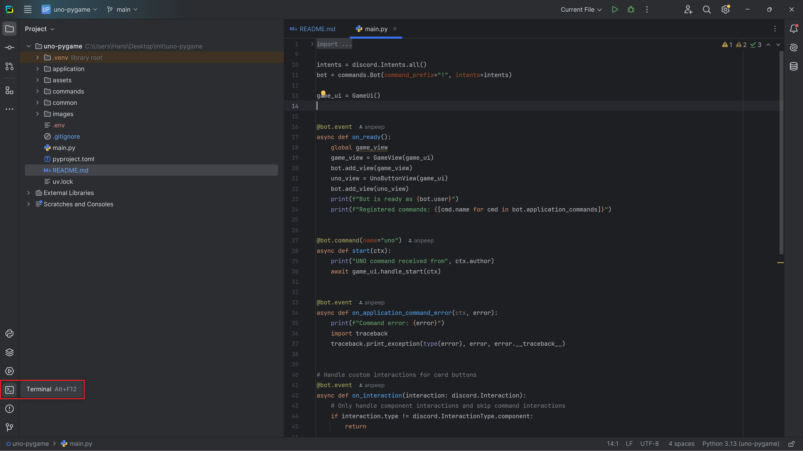

# Unobot

## Vajalike lisade alla laadimine    
Ava käsurida (<kbd>alt</kbd>+<kbd>F12</kbd>) või vali alt vasakult menüüst terminal.  


Peale seda sisesta konsooli järgnev käsk, vajuta <kbd>Enter</kbd> ning oota kuni see lõpetab.  
```bash
pip install py-cord audioop-lts python-dotenv
```


## Tokeni lisamine  
Ava main.py fail ning keri faili lõppu.
Seal on järgnev rida: `bot.run("token")`
Pane `token` asemel enda boti token (jutumärgid peavad alles jääma tokeni algusesse ja lõppu).  


## Boti jooksutamine 🐍
Ava jälle main.py fail. Kõige üleval on selline rida
```python
bot = commands.Bot(command_prefix="!", intents=intents)
```
Muuda seal "!" mingi muu sümboli või emoji vastu (emojisid saab valida vajutades <kbd>Win</kbd>+<kbd>.</kbd>), näiteks
```python
bot = commands.Bot(command_prefix="🍪", intents=intents)
```

Üleval ribal vajuta rohelist kolmnurka ning siis peaks bot tööle minema.
