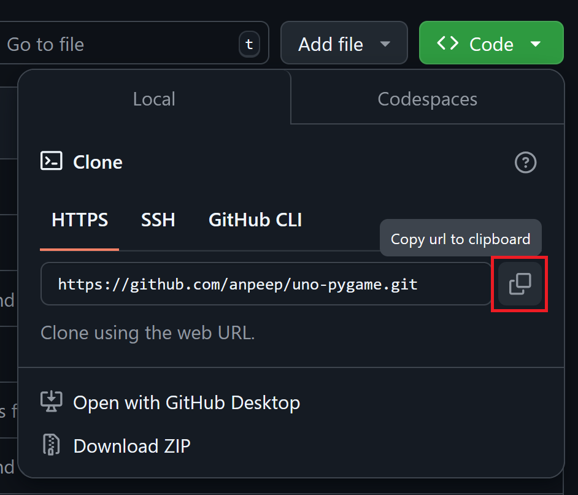
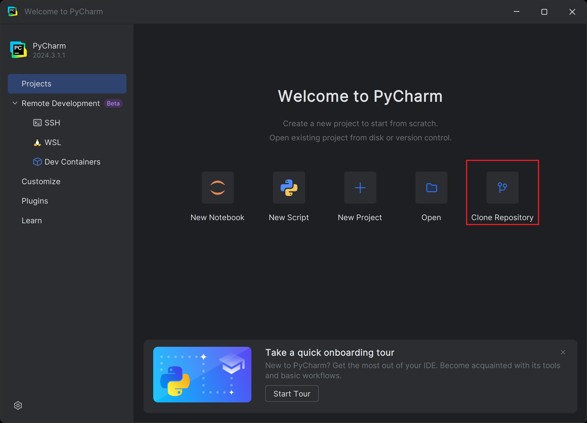
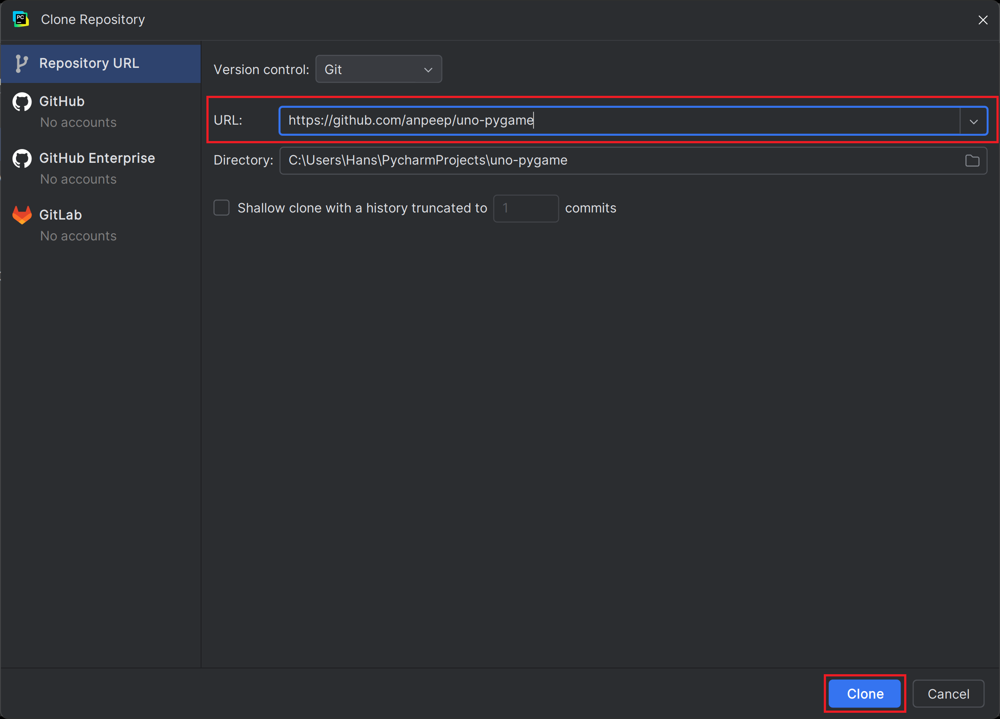

# Unobot

## Projekti alla laadimine
GitHubis vali __code__ -> __Copy to clipboard__  


Ava PyCharm ning vali __Clone Repository__
Aseta URL-i alla kopeeritud link ning vajuta __clone__. (kui ütleb et selline projekt on olemas, siis muuda projekti nime (Directorys), nt pane _-1_ lõppu)  




## Vajalike lisade alla laadimine    
Ava käsurida (<kbd>alt</kbd>+<kbd>F12</kbd> või vali alt vasakult menüüst terminal).  


Peale seda sisesta konsooli järgnev käsk, vajuta <kbd>Enter</kbd> ning oota kuni see lõpetab.  
```bash
pip install py-cord audioop-lts python-dotenv
```


## Tokeni lisamine      
Ava või loo `.env` fail ning lisa `TOKEN=` lõppu enda discordi boti token.


## Boti jooksutamine 🐍
Ava jälle main.py fail. Kõige üleval on selline rida
```python
bot = commands.Bot(command_prefix="!", intents=intents)
```
Muuda seal "!" mingi muu sümboli või emoji vastu (emojisid saab valida vajutades <kbd>Win</kbd>+<kbd>.</kbd>), näiteks
```python
bot = commands.Bot(command_prefix="🍪", intents=intents)
```

Üleval ribal vajuta rohelist kolmnurka ning siis peaks bot tööle minema.
